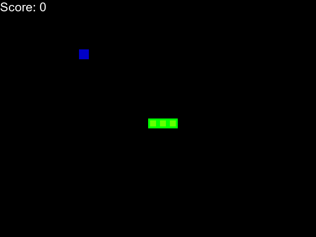

# Learning With Human Feedback

This project offers a full stack solution for training machine learning models with human preferences. Our initial work trains an agent to play the game Snake 🐍 based on the performance of a human expert.

# Project Structure

**Backend:** The backend is responsible for training models and CRUD operations. Written in python with the django framework.

**Frontend:** The frontend is a web application for displaying data and collection human gameplay observations. Written in typescript with the NextJs framework.

# Models

Every experiment creates three distinct models on the backend. These models are listed below:

- A finetuned model that uses long term experience replay to update a pre-trained rl agent. This model achieves the best score relative to the other two.
- A supervised policy model that predicts actions given state. Trained for twenty epochs with the adam optimizer.
- An inverse q learning model that learns the q-values for a given state. tarined on state-action-reward-next_state observations.

# TLDR Results

We find that immitation learning is insufficient for modeling the decisions of a human player within the game of snake. The large state space requires more observations than can reasonably be obtained from a human player. In addition, a single playing style may have multiple valid actions at a given state resulting in noisy state-action observations. Finally, supervised methods for immitation learning are heavily impacted by the data imbalance inherent to the game of snake (straight actions are much more common than turns).

We found the best scoring model to be the pre-trained RL-agent finetuned on human gameplay observations. This setup consistently achieved scores above fourty.

# Deploymnent

Deployment docs are still being created. This section will be updated once we have more thorough deployment documentation.

**Frontend:** Vercel

**Backend Api:** Google App Standard Engine F4 Instance

**Postgres Database:** Supabase

# Known Issues

This project is still in active development. While essential features are present there are a few production bugs that may affect performance.

- Production response times are _slow_, due to cold starts on the backend hosting provider.
- Client side snake game becomes laggy after around five minutes of gameplay.

- Backend server msay run out of memory while training models, depending on request load.
